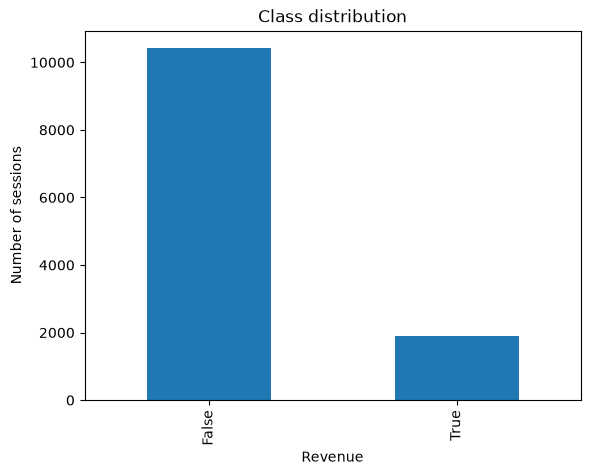
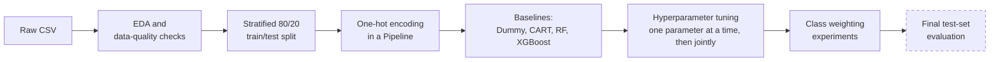

# Machine Learning

Coursework projects for ITI41720-1 Machine Learning and Deep Learning (autumn 2026), built with Python, scikit-learn and XGBoost.


---

## Contents

- [Projects](#projects)
- [Project 1: Online shoppers purchasing intention](#project-1-online-shoppers-purchasing-intention)
  - [Dataset](#dataset)
  - [Approach](#approach)
  - [Results](#results)
  - [Key findings](#key-findings)
- [Getting started](#getting-started)
- [Repository structure](#repository-structure)
- [Status](#status)
- [Acknowledgements](#acknowledgements)

## Projects

| # | Project | Task | Models | Notebook |
| --- | --- | --- | --- | --- |
| 1 | Online shoppers purchasing intention | Binary classification on imbalanced data | CART, Random Forest, XGBoost | [`analysis.ipynb`](project1/notebooks/analysis.ipynb) |

---

## Project 1: Online shoppers purchasing intention

The project asks whether a browsing session on an e-commerce site will end in a purchase. It predicts the `Revenue` target from page-visit counts, time on page, Google Analytics metrics and session context.

### Dataset

[Online Shoppers Purchasing Intention](https://archive.ics.uci.edu/dataset/468/online+shoppers+purchasing+intention+dataset) from the UCI Machine Learning Repository (Sakar et al., 2019).

| Property | Value |
| --- | --- |
| Sessions | 12,330 (12,205 unique; 125 exact duplicates) |
| Predictors | 17: 10 numeric, 6 categorical, 1 binary |
| Target | `Revenue` (did the session end in a purchase?) |
| Class balance | 84.5% no purchase / 15.5% purchase |
| Missing values | None |



#### Feature groups

- **Numeric:** `Administrative`, `Administrative_Duration`, `Informational`, `Informational_Duration`, `ProductRelated`, `ProductRelated_Duration`, `BounceRates`, `ExitRates`, `PageValues`, `SpecialDay`
- **Categorical:** `Month`, `OperatingSystems`, `Browser`, `Region`, `TrafficType`, `VisitorType`
- **Binary:** `Weekend`

### Approach



1. **Exploratory analysis.** Checked shapes, dtypes, missing values, duplicates, label conflicts, skew and the target distribution. No identical predictor rows carry conflicting labels.
2. **Preprocessing.** A `ColumnTransformer` one-hot encodes the categorical features with `handle_unknown="ignore"` and passes the numeric and binary features through unchanged. Preprocessing sits inside each model `Pipeline`, so cross-validation folds do not leak information.
3. **Evaluation protocol.** Uses `RepeatedStratifiedKFold` (5 folds × 3 repeats) on the training set only. The 20% test set stays held out. **Average precision (PR-AUC)** is the main metric because the positive class is the minority.
4. **Tuning.** Each important hyperparameter is first swept on its own to see its effect. Promising ranges then go into a joint `GridSearchCV` (CART) or `RandomizedSearchCV` (Random Forest, XGBoost).
5. **Class imbalance.** Compares `class_weight="balanced"` (CART, Random Forest) and `scale_pos_weight ≈ 5.46` (XGBoost) against the unweighted tuned models.

### Results

All numbers are cross-validated means on the training set (5 × 3 repeated stratified CV).

#### Baseline vs. tuned

| Model | PR-AUC (baseline) | PR-AUC (tuned) | ROC-AUC (tuned) | F1 (tuned) |
| --- | :---: | :---: | :---: | :---: |
| CART | 0.379 | 0.713 | 0.921 | 0.646 |
| Random Forest | 0.735 | **0.758** | 0.933 | 0.658 |
| XGBoost | 0.726 | 0.757 | **0.934** | **0.664** |

The dummy classifier reaches 84.5% test accuracy by always predicting "no purchase". This shows why accuracy alone misleads on this dataset.

#### Selected hyperparameters

| Model | Configuration |
| --- | --- |
| CART | `max_depth=6`, `min_samples_leaf=50`, `ccp_alpha=0.0` |
| Random Forest | `n_estimators=300`, `max_features=0.3`, `max_depth=10`, `min_samples_leaf=10` |
| XGBoost | `n_estimators=100`, `learning_rate=0.05`, `max_depth=4` |

#### Effect of class weighting

| Model | Precision | Recall | Balanced acc. | F1 | PR-AUC |
| --- | :---: | :---: | :---: | :---: | :---: |
| CART | 0.717 | 0.590 | 0.773 | 0.646 | 0.713 |
| CART (weighted) | 0.502 | **0.855** | 0.850 | 0.632 | 0.705 |
| Random Forest | **0.743** | 0.591 | 0.777 | 0.658 | **0.758** |
| Random Forest (weighted) | 0.541 | 0.836 | 0.853 | 0.657 | 0.752 |
| XGBoost | 0.732 | 0.608 | 0.783 | **0.664** | 0.757 |
| XGBoost (weighted) | 0.539 | 0.841 | **0.855** | 0.657 | 0.753 |

### Key findings

- **The unrestricted CART overfits heavily.** Limiting depth and requiring larger leaves almost doubles its PR-AUC, from 0.38 to 0.71.
- **The ensembles are close to each other.** After tuning, Random Forest and XGBoost perform about the same (PR-AUC ≈ 0.76, ROC-AUC ≈ 0.93). The gap between them is smaller than the variation across folds.
- **XGBoost works best with few trees and a moderate learning rate.** With `learning_rate=0.1`, PR-AUC drops steadily as `n_estimators` grows past 50.
- **Class weighting moves the decision threshold but does not improve ranking.** Recall rises from about 0.60 to 0.84–0.86 and precision falls from about 0.73 to 0.50–0.54. ROC-AUC and PR-AUC stay almost unchanged. Use the weighted models when a missed purchaser costs more than a false alarm.
- **`PageValues` separates the classes strongly.** Purchasing sessions have a mean of 27.3, against 2.0 for non-purchasing sessions.

---

## Getting started

**Requirements:** Python 3.13 and `pip`.

```bash
# Clone the repository
git clone git@github.com:EmilB04/Machine-Learning.git
cd Machine-Learning

# Create and activate a virtual environment
python3 -m venv .venv
source .venv/bin/activate        # Windows: .venv\Scripts\activate

# Install dependencies
pip install -r project1/requirements.txt

# Start Jupyter
jupyter lab project1/notebooks/analysis.ipynb
```

The notebook loads data with relative paths (`../data/...`), so run it from the `project1/notebooks/` directory. Jupyter does this by default.

> [!NOTE]
> The tuning sections run many repeated cross-validation fits with `n_jobs=1`. A full run takes some time. Set `n_jobs=-1` to use all CPU cores.

## Repository structure

```text
Machine-Learning/
├── README.md
└── project1/
    ├── data/
    │   ├── online_shoppers_intention.csv          # Raw UCI dataset (12,330 rows)
    │   └── online_shoppers_intention_clean.csv    # Exact duplicates removed (12,205 rows)
    ├── figures/
    │   └── class-imbalance.png                    # Target class distribution
    ├── notebooks/
    │   └── analysis.ipynb                         # EDA, modeling, tuning, class weighting
    └── requirements.txt                           # Pinned dependencies
```

## Status

- [x] Exploratory data analysis and data-quality checks
- [x] Preprocessing pipeline and stratified split
- [x] Baseline models (Dummy, CART, Random Forest, XGBoost)
- [x] Hyperparameter tuning for all three model families
- [x] Class-weighting experiments
- [ ] Final model selection and evaluation on the held-out test set
- [ ] Threshold tuning and feature importance analysis

## Acknowledgements

Sakar, C. O., Polat, S. O., Katircioglu, M., & Kastro, Y. (2019). *Real-time prediction of online shoppers' purchasing intention using multilayer perceptron and LSTM recurrent neural networks.* Neural Computing and Applications, 31, 6893–6908.
